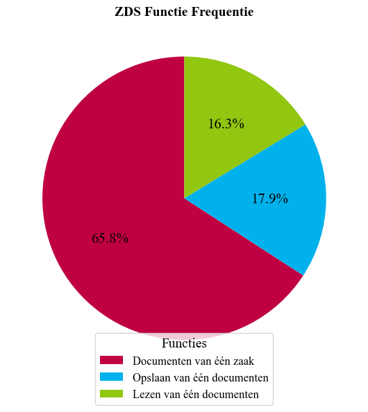
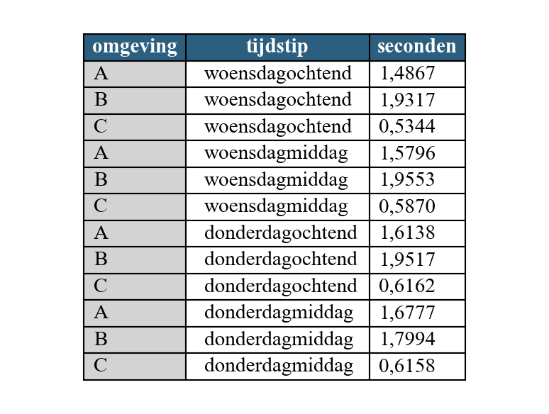
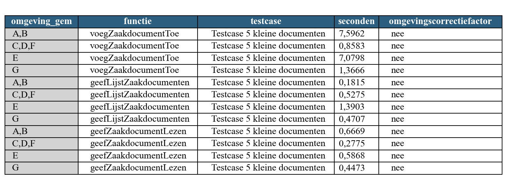
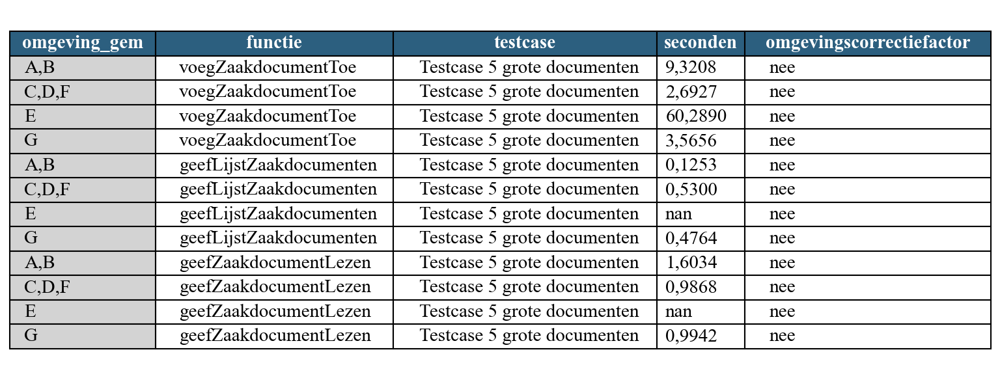

# ZGW DRC-onderzoek: snelheidsmetingen (samenvatting)

> Dit is een ontdane samenvatting van een intern onderzoeksmemo (Corsa O24.003098, Eduard Witteveen en Andre
> Wolters, 28 november 2024). De volledige memo bevat productie-interne hostnamen/endpoints en de ruwe,
> stap-voor-stap SoapUI-testlogs per omgeving — die zijn hier bewust **niet** overgenomen. Dit document bevat
> de kern: aanleiding, conclusie, vergelijking en de belangrijkste geaggregeerde resultaten.

## Aanleiding

Dit onderzoek vergelijkt verschillende Document Registratie Componenten (DRC's) binnen OpenZaak, om de
volgende redenen:

- **Einde van de CMIS-adapter**: wordt niet meer ondersteund in nieuwere versies van OpenZaak.
- **Corsa gaat naar de cloud**: de huidige Corsa-CMIS-oplossing is bedoeld voor lokale servers en wordt
  daardoor niet langer bruikbaar.
- **Prestatieproblemen**: de huidige opzet (vooral Corsa-CMIS) is soms traag.
- **Toekomstbestendigheid**: gemeenten willen een oplossing die klaar is voor verandering en groei.

## Conclusie

Overstappen op een nieuwe DRC is aan te raden. De huidige Corsa-CMIS-oplossing werkt nog, maar wordt niet
meer ondersteund en presteert minder goed; de Corsa-DRC voldoet niet volledig aan de nieuwste eisen (o.a.
verouderde ZGW-API-versie v1.1.1, geen ZTC/AC-controle).

**De OpenZaak-DRC is de betere keuze** — sneller, eenvoudiger, en toekomstbestendig. Met name de
**expand-functionaliteit** (zoals gebruikt in de `feature-expand`-branch van dit project) zorgt voor
betere prestaties bij veelgebruikte functies.

## Vergelijking van de opties

| Optie | Omschrijving | Beperkingen |
|---|---|---|
| **Corsa-CMIS** | CMIS-adapter in OpenZaak vertaalt naar het CMIS-protocol; documenten blijven in Corsa. | CMIS-adapter is EOL in nieuwere OpenZaak-versies. De "fast-DRC"-hack die dit versnelde werkt alleen on-premises en vervalt zodra Corsa naar de cloud gaat. |
| **Corsa-DRC** | Module in Corsa zelf die de ZGW-Documenten-API rechtstreeks aanbiedt. | Ondersteunt alleen een oudere ZGW-API-versie (v1.1.1); mist verplichte ZTC-/AC-controle. |
| **OpenZaak-DRC** | Standaard, lokale documentopslag binnen OpenZaak zelf. | Geen bekende beperkingen t.o.v. de standaard; volledig up-to-date met ZGW-API's. |
| **OpenZaak-DRC + expand** | Als hierboven, met de OpenZaakBrug's expand-functionaliteit (ZGW ≥ 1.5) om meerdere losse bevragingen te combineren tot één call. | Vereist een nieuwere OpenZaakBrug-versie; zie `feature-expand`-branch. |

## Huidig productiegebruik (waarom deze 3 functies de focus kregen)

Uit productielogging bleek welke ZDS-functies het meest gebruikt worden — de top-3 (`GeefLijstZaakdocumenten`,
`VoegZaakdocumentToe`, `GeefZaakdocumentLezen`) kreeg daarom de focus in dit onderzoek, omdat winst op de
meest-gebruikte functies de hoogste business value oplevert.

## Testopzet

De testen zijn uitgevoerd met een SoapUI TestSuite (zie
[`examples/soap/performance-tests-soapui-project.xml`](../../examples/soap/performance-tests-soapui-project.xml)
in dit project), met testcases van 5 en 20 documenten (klein ≈ 100 kB, groot ≈ 3,5 MB), waarbij telkens
documenten worden toegevoegd, de documentenlijst wordt opgevraagd en documenten worden gelezen.

De testen liepen over meerdere omgevingen (productie, test, acceptatie en ontwikkeling), met verschillende
combinaties van DRC (cmis-corsa, corsa-drc, openzaak-drc) en OpenZaakBrug-versie (huidige versie / nieuwe
versie met en zonder expand-ondersteuning). Voor platformverschillen (bijv. IDE vs. geïnstalleerd, on-prem vs.
SaaS) is gecorrigeerd met een referentieomgeving, omdat deze factoren zelf ook meetbare invloed op de
responstijd bleken te hebben (tot ruim 2x langzamer voor een ontwikkelomgeving met SaaS-OpenZaak t.o.v. een
vergelijkbare on-prem opstelling).

Er is ook gekeken naar het tijdstip van meting (ochtend/middag, opeenvolgende dagen) — hierin was geen
duidelijk patroon te zien; serverbelasting/netwerk lijken een grotere rol te spelen dan het tijdstip zelf.

## Resultaten

Gemiddelde responstijd over alle geteste functies/testcases, met en zonder correctie voor platformverschil:

Per omgevingsgroep (A,B = productie/test met cmis-corsa; C,D,F = acceptatie/ontwikkeling met openzaak-drc;
E = corsa-drc; G = openzaak-drc met expand):

De corsa-drc-opslag (E) is duidelijk het traagst. De file-opslag met expand (G) is het snelst, en presteert
beter dan de standaard file-opslag zonder expand (C,D,F) — dit onderbouwt de conclusie hierboven.
